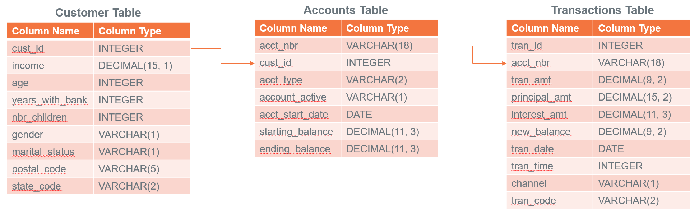
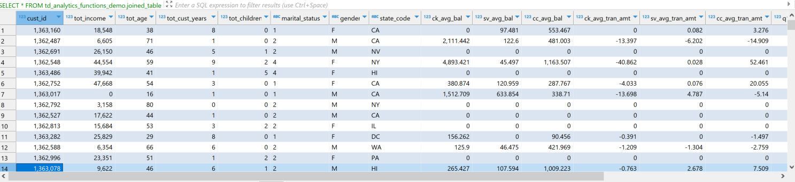
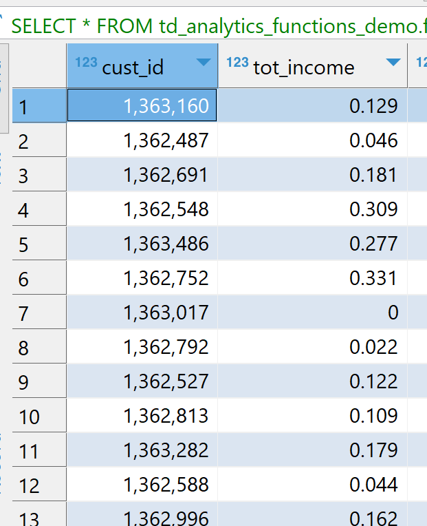
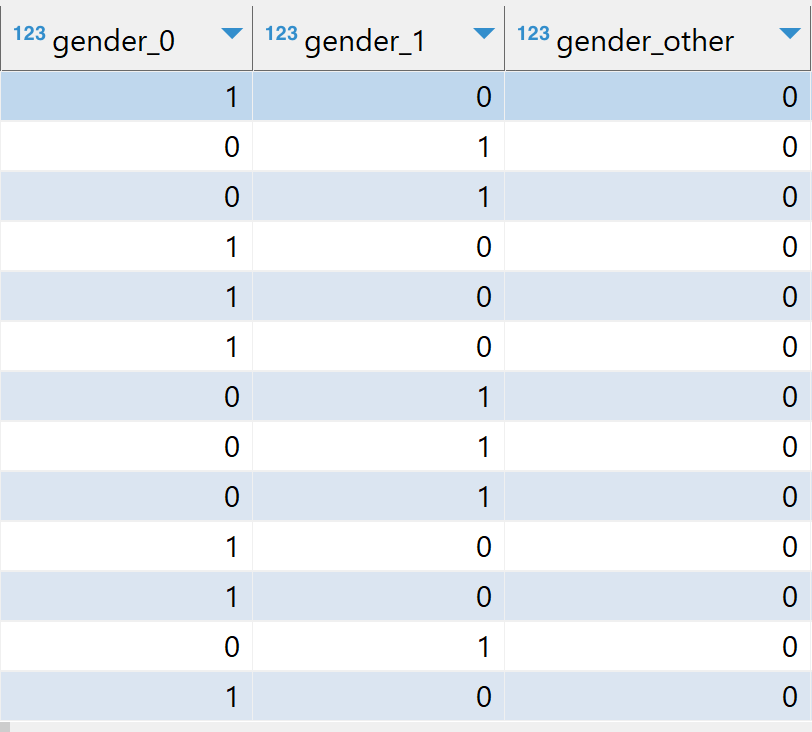
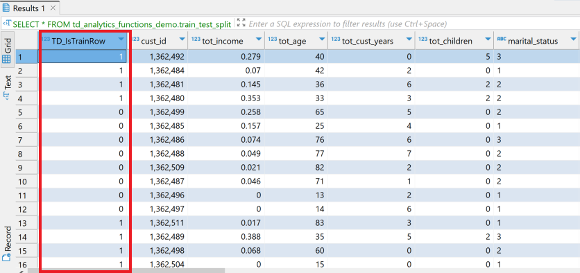
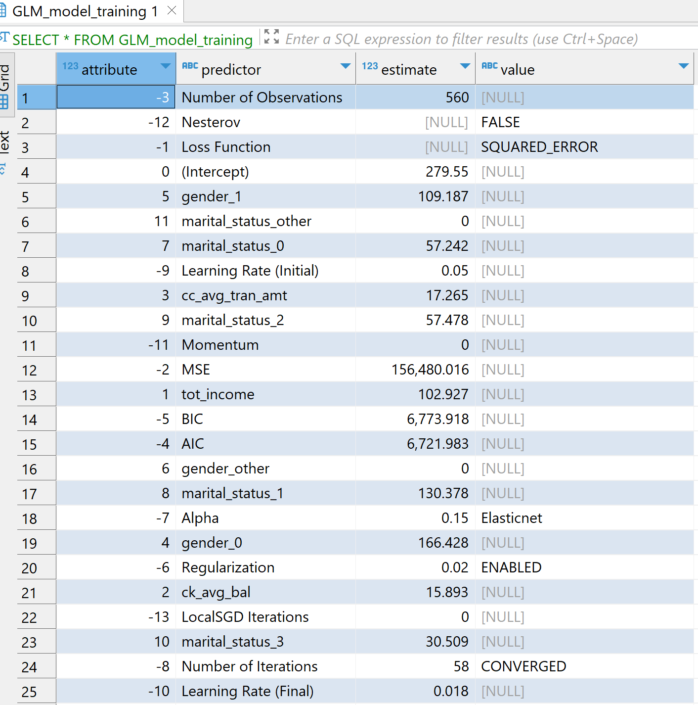
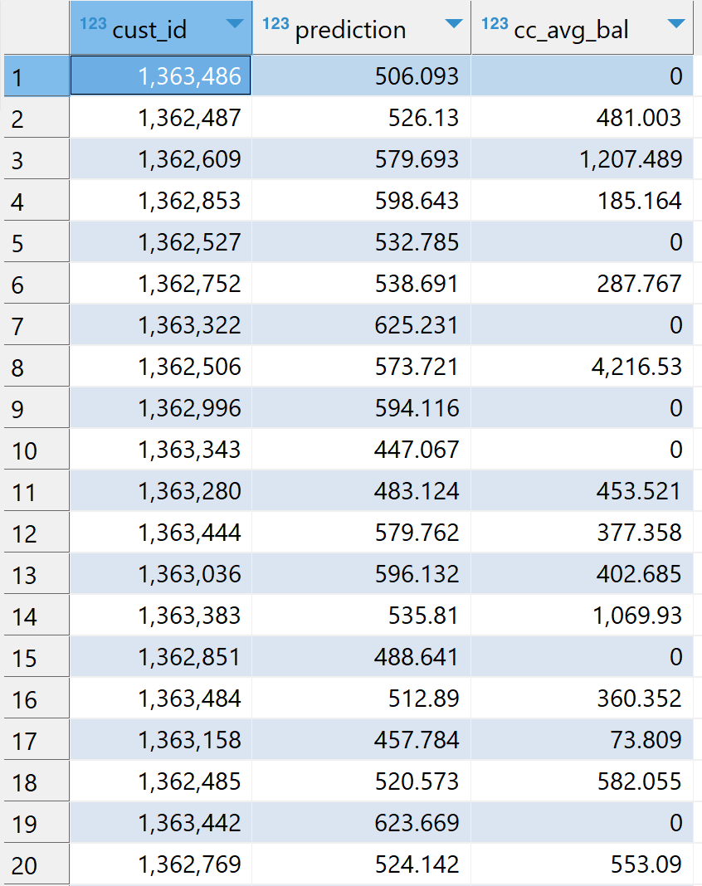
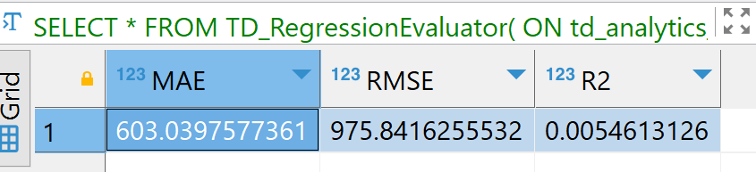

import TrialDocsNote from '../_partials/teradata_trial.mdx'

# Train ML models in Teradata using In-Database Analytic Functions

## Overview

There are situations where you want to quickly validate a machine learning model idea. You may have a model type in mind, but you may not want to operationalize it with an ML pipeline yet. You just want to test whether the relationship you have in mind exists. In some cases, even a production deployment may not require constant retraining with MLOps.

In such cases, you can use In-Database Analytic Functions for feature engineering, training different ML models, scoring models, and evaluating model performance.

## Prerequisites

You need access to a Teradata instance.

<TrialDocsNote />

## Load the sample data

In this example, we use sample data from the `val` database. We use the `accounts`, `customer`, and `transactions` tables. Since we will create tables during this process, and you might face issues creating tables directly in the `val` database, let's create our own database, `td_analytics_functions_demo`.

```sql
CREATE DATABASE td_analytics_functions_demo
AS PERMANENT = 110e6;
```

!!! note
    You must have `CREATE TABLE` permissions on the database where you want to use In-Database Analytic Functions.

Let's now create the `accounts`, `customer`, and `transactions` tables in our `td_analytics_functions_demo` database from the corresponding tables in the `val` database.

!!! note
    If you are using DBeaver, run each `CREATE TABLE` statement separately or ensure Auto-commit is enabled. Running multiple DDL statements together may result in the following error: `Only an ET or null statement is legal after a DDL Statement.`

```sql
DATABASE td_analytics_functions_demo;

CREATE TABLE customer AS (
  SELECT * FROM val.customer
) WITH DATA;

CREATE TABLE accounts AS (
  SELECT * FROM val.accounts
) WITH DATA;

CREATE TABLE transactions AS (
  SELECT * FROM val.transactions
) WITH DATA;
```

## Understand the sample data

Now that we have our sample tables loaded into `td_analytics_functions_demo`, let's explore the data. 
This is a simple, fictitious banking dataset with approximately 700 customer records, 1,400 account records, and 77,000 transaction records. The tables are related to each other as shown below:



In the next steps, we will explore whether we can build a model that predicts a banking customer's average monthly credit card balance based on non-credit-card-related variables from the tables.

## Prepare the dataset
 
We have data in three tables that we want to join and use to create features. Let's start by creating a joined table.

```sql
-- Create a consolidated joined_table from customer, accounts, and transactions
CREATE TABLE td_analytics_functions_demo.joined_table AS (
  SELECT
    T1.cust_id AS cust_id,
    MIN(T1.income) AS tot_income,
    MIN(T1.age) AS tot_age,
    MIN(T1.years_with_bank) AS tot_cust_years,
    MIN(T1.nbr_children) AS tot_children,
    MIN(T1.marital_status) AS marital_status,
    MIN(T1.gender) AS gender,
    MAX(T1.state_code) AS state_code,
    AVG(CASE WHEN T2.acct_type = 'CK' THEN T2.starting_balance + T2.ending_balance ELSE 0 END) AS ck_avg_bal,
    AVG(CASE WHEN T2.acct_type = 'SV' THEN T2.starting_balance + T2.ending_balance ELSE 0 END) AS sv_avg_bal,
    AVG(CASE WHEN T2.acct_type = 'CC' THEN T2.starting_balance + T2.ending_balance ELSE 0 END) AS cc_avg_bal,
    AVG(CASE WHEN T2.acct_type = 'CK' THEN T3.principal_amt + T3.interest_amt ELSE 0 END) AS ck_avg_tran_amt,
    AVG(CASE WHEN T2.acct_type = 'SV' THEN T3.principal_amt + T3.interest_amt ELSE 0 END) AS sv_avg_tran_amt,
    AVG(CASE WHEN T2.acct_type = 'CC' THEN T3.principal_amt + T3.interest_amt ELSE 0 END) AS cc_avg_tran_amt,
    COUNT(CASE WHEN ((EXTRACT(MONTH FROM T3.tran_date) + 2) / 3) = 1 THEN T3.tran_id ELSE NULL END) AS q1_trans_cnt,
    COUNT(CASE WHEN ((EXTRACT(MONTH FROM T3.tran_date) + 2) / 3) = 2 THEN T3.tran_id ELSE NULL END) AS q2_trans_cnt,
    COUNT(CASE WHEN ((EXTRACT(MONTH FROM T3.tran_date) + 2) / 3) = 3 THEN T3.tran_id ELSE NULL END) AS q3_trans_cnt,
    COUNT(CASE WHEN ((EXTRACT(MONTH FROM T3.tran_date) + 2) / 3) = 4 THEN T3.tran_id ELSE NULL END) AS q4_trans_cnt
  FROM td_analytics_functions_demo.customer AS T1
  LEFT OUTER JOIN td_analytics_functions_demo.accounts AS T2
    ON T1.cust_id = T2.cust_id
  LEFT OUTER JOIN td_analytics_functions_demo.transactions AS T3
    ON T2.acct_nbr = T3.acct_nbr
  GROUP BY T1.cust_id
) WITH DATA UNIQUE PRIMARY INDEX (cust_id);
```

Let's now see how our data looks. 

```sql
SELECT TOP 10 *
FROM td_analytics_functions_demo.joined_table;
```

The dataset has both categorical and continuous features, or independent variables. In our case, the dependent variable is `cc_avg_bal`, which is the customer's average credit card balance.



## Feature engineering

After looking at the data, we can see that there are several features we can use to predict `cc_avg_bal`.

### TD_OneHotEncodingFit

Our dataset includes categorical features such as `gender`, `marital_status`, and `state_code`. We will use the In-Database Analytic Function [TD_OneHotEncodingFit](https://docs.teradata.com/r/Enterprise_IntelliFlex_VMware/Database-Engine-20-In-Database-Analytic-Functions/Feature-Engineering-Transform-Functions/TD_OneHotEncodingFit) to encode these categories into one-hot numeric vectors.

```sql
CREATE VIEW td_analytics_functions_demo.one_hot_encoding_joined_table_input AS (
  SELECT * FROM TD_OneHotEncodingFit(
    ON td_analytics_functions_demo.joined_table AS InputTable
    USING
    IsInputDense('true')
    TargetColumn('gender', 'marital_status', 'state_code')
    CategoryCounts(2, 4, 33)
    Approach('Auto')
  ) AS dt
);
```

### TD_ScaleFit

Some columns, such as `tot_income`, `ck_avg_bal`, and transaction count columns, have values in different ranges. For optimization algorithms like gradient descent, it is important to normalize values to the same scale for faster convergence, scale consistency, and improved model performance.

We will use the [TD_ScaleFit](https://docs.teradata.com/r/Enterprise_IntelliFlex_VMware/Database-Engine-20-In-Database-Analytic-Functions/Feature-Engineering-Transform-Functions/TD_ScaleFit) function to normalize values across different scales.

```sql
CREATE VIEW td_analytics_functions_demo.scale_fit_joined_table_input AS (
  SELECT * FROM TD_ScaleFit(
    ON td_analytics_functions_demo.joined_table AS InputTable
    USING
    TargetColumns('tot_income', 'q1_trans_cnt', 'q2_trans_cnt', 'q3_trans_cnt', 'q4_trans_cnt', 'ck_avg_bal', 'sv_avg_bal', 'ck_avg_tran_amt', 'sv_avg_tran_amt', 'cc_avg_tran_amt')
    ScaleMethod('RANGE')
  ) AS dt
);
```

### TD_ColumnTransformer

Teradata In-Database Analytic Functions typically operate in pairs for data transformations. The first function fits the data and generates the required parameters. The second function uses those parameters to transform the input data.
The [TD_ColumnTransformer](https://docs.teradata.com/r/Enterprise_IntelliFlex_VMware/Database-Engine-20-In-Database-Analytic-Functions/Feature-Engineering-Transform-Functions/TD_ColumnTransformer) function takes the fit tables as input and transforms the input table columns in a single operation.


```sql
-- Use a consolidated transform function
CREATE TABLE td_analytics_functions_demo.feature_enriched_accounts_consolidated AS (
  SELECT * FROM TD_ColumnTransformer(
    ON td_analytics_functions_demo.joined_table AS InputTable
    ON td_analytics_functions_demo.one_hot_encoding_joined_table_input AS OneHotEncodingFitTable DIMENSION
    ON td_analytics_functions_demo.scale_fit_joined_table_input AS ScaleFitTable DIMENSION
  ) AS dt
) WITH DATA;
```

After we perform the transformation, we can see that the categorical columns are one-hot encoded and the numeric values are scaled, as shown in the images below. For example, `tot_income` is in the range `[0, 1]`, and `gender` is one-hot encoded into `gender_0`, `gender_1`, and `gender_other`.







## Train/test split

Now that our dataset is ready with scaled and encoded features, let's split it into training and testing datasets. We will use 75% of the data for training and 25% for testing.

Teradata In-Database Analytic Functions provide the [TD_TrainTestSplit](https://docs.teradata.com/r/Enterprise_IntelliFlex_VMware/Database-Engine-20-In-Database-Analytic-Functions/Model-Evaluation-Functions/TD_TrainTestSplit) function, which we will use to split our dataset.

```sql
-- Create a train/test split on the input table
CREATE VIEW td_analytics_functions_demo.train_test_split AS (
  SELECT * FROM TD_TrainTestSplit(
    ON td_analytics_functions_demo.feature_enriched_accounts_consolidated AS InputTable
    USING
    IDColumn('cust_id')
    TrainSize(0.75)
    TestSize(0.25)
    Seed(42)
  ) AS dt
);
```

As shown below, the function adds a new column, `TD_IsTrainRow`, where `1` indicates a training row and `0` indicates a testing row.



We will use `TD_IsTrainRow` to create two tables: one for training and one for testing.

```sql
-- Create the training table
CREATE TABLE td_analytics_functions_demo.training_table AS (
  SELECT *
  FROM td_analytics_functions_demo.train_test_split
  WHERE TD_IsTrainRow = 1
) WITH DATA;
```

```sql
-- Create the testing table
CREATE TABLE td_analytics_functions_demo.testing_table AS (
  SELECT *
  FROM td_analytics_functions_demo.train_test_split
  WHERE TD_IsTrainRow = 0
) WITH DATA;
```

## Training with generalized linear model 

We will now use the [TD_GLM](https://docs.teradata.com/r/Enterprise_IntelliFlex_VMware/Database-Engine-20-In-Database-Analytic-Functions/Model-Training-Functions/TD_GLM) In-Database Analytic Function to train our model on the training dataset. The `TD_GLM` function is a generalized linear model (GLM) that performs regression and classification analysis on datasets.

In this example, we use input columns such as `tot_income`, `ck_avg_bal`, `cc_avg_tran_amt`, and one-hot encoded values for marital status, gender, and state. The dependent, or response, column is `cc_avg_bal`. Since `cc_avg_bal` is a continuous value, this is a regression problem. We use `Family` as `Gaussian` for regression and `Binomial` for classification.

The `Tolerance` parameter specifies the minimum improvement required in prediction accuracy for the model to continue iterating, while `MaxIterNum` specifies the maximum number of iterations allowed. Training stops when either condition is met first. In the example below, the model reaches `CONVERGED` status after 58 iterations.

```sql
-- Train the GLM model using the training dataset
CREATE TABLE td_analytics_functions_demo.GLM_model_training AS (
  SELECT * FROM TD_GLM(
    ON td_analytics_functions_demo.training_table AS InputTable
    USING
    InputColumns('tot_income', 'ck_avg_bal', 'cc_avg_tran_amt', '[19:26]')
    ResponseColumn('cc_avg_bal')
    Family('Gaussian')
    MaxIterNum(300)
    Tolerance(0.001)
    Intercept('true')
  ) AS dt
) WITH DATA;
```



## Scoring on testing dataset

We will now use our model, `GLM_model_training`, to score the testing dataset, `testing_table`, using the [TD_GLMPredict](https://docs.teradata.com/r/Enterprise_IntelliFlex_VMware/Database-Engine-20-In-Database-Analytic-Functions/Model-Scoring-Functions/TD_GLMPredict) In-Database Analytic Function.

```sql
-- Score the GLM model on the testing dataset
CREATE TABLE td_analytics_functions_demo.GLM_model_test_prediction AS (
  SELECT * FROM TD_GLMPredict(
    ON td_analytics_functions_demo.testing_table AS InputTable
    ON td_analytics_functions_demo.GLM_model_training AS ModelTable DIMENSION
    USING
    IDColumn('cust_id')
    Accumulate('cc_avg_bal')
  ) AS dt
) WITH DATA;
```



## Model evaluation

Finally, we evaluate our model on the scored results. We will use the [TD_RegressionEvaluator](https://docs.teradata.com/r/Enterprise_IntelliFlex_VMware/Database-Engine-20-In-Database-Analytic-Functions/Model-Evaluation-Functions/TD_RegressionEvaluator) function for model evaluation. The model can be evaluated using metrics such as `RMSE`, `MAE`, and `R2`. 

```sql
-- Evaluate the model
SELECT * FROM TD_RegressionEvaluator(
  ON td_analytics_functions_demo.GLM_model_test_prediction AS InputTable
  USING
  ObservationColumn('cc_avg_bal')
  PredictionColumn('prediction')
  Metrics('RMSE', 'MAE', 'R2')
) AS dt;
```



!!! note
    The purpose of this how-to is not to describe feature engineering in detail, but to demonstrate how we can use different In-Database Analytic Functions in Teradata. The model results might not be optimal, and the process of building the best model is beyond the scope of this article.

## Summary

In this quickstart, we learned how to create ML models using Teradata In-Database Analytic Functions. We created our own database, `td_analytics_functions_demo`, and loaded the `customer`, `accounts`, and `transactions` data from the `val` database.

We performed feature engineering using `TD_OneHotEncodingFit`, `TD_ScaleFit`, and `TD_ColumnTransformer`. We then used `TD_TrainTestSplit` to split the dataset into training and testing tables. Next, we trained a model using `TD_GLM`, scored the testing dataset using `TD_GLMPredict`, and evaluated the scored results using `TD_RegressionEvaluator`.
 

## Further reading

* [Teradata In-Database Analytic Functions](https://docs.teradata.com/r/Enterprise_IntelliFlex_VMware/Database-Engine-20-In-Database-Analytic-Functions)