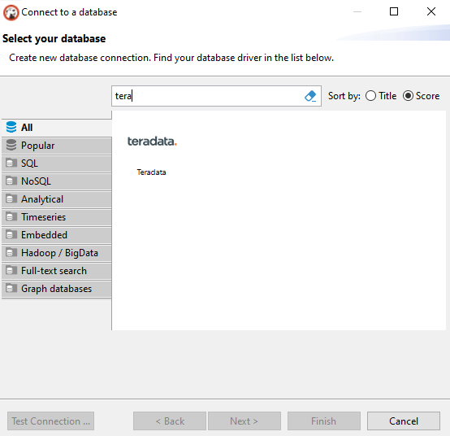
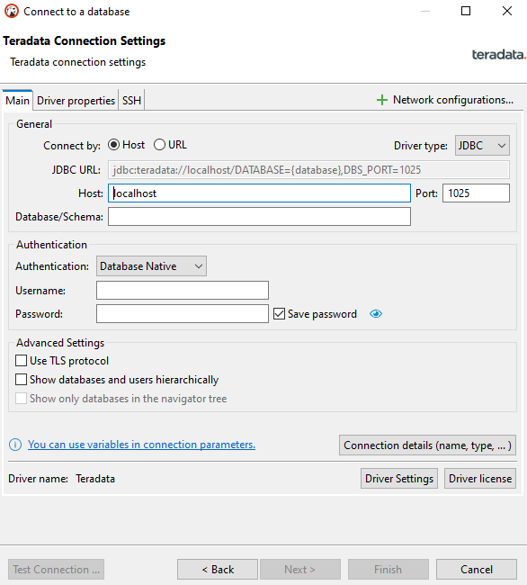
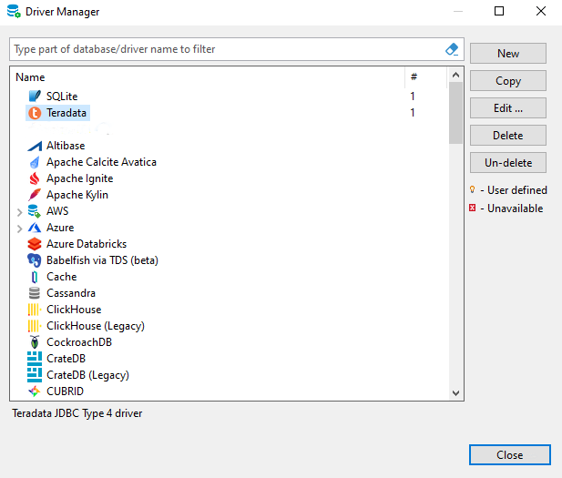
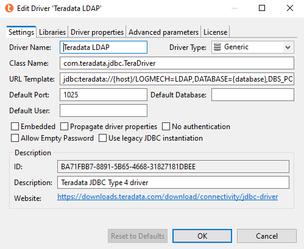
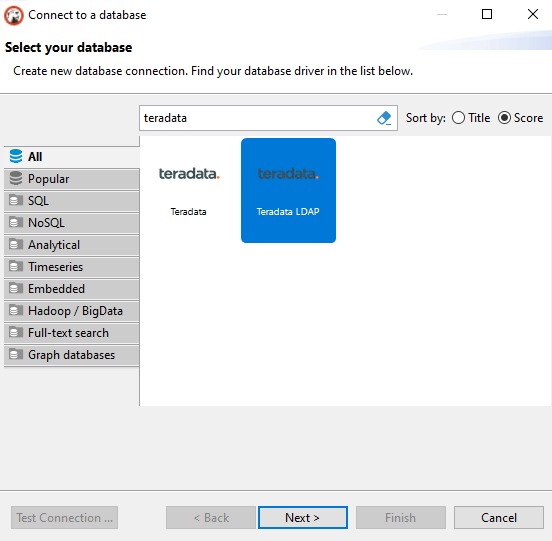
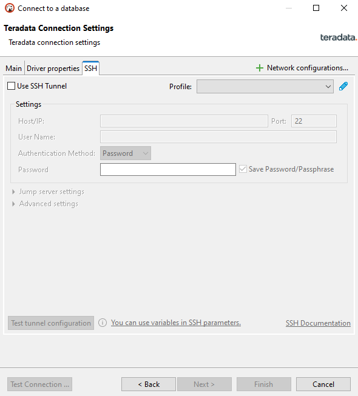

# Configure a Teradata connection in DBeaver

## Overview

This how-to shows how to create a Teradata connection with DBeaver.

## Prerequisites

import TrialDocsNote from '../_partials/teradata_trial.mdx'

* Access to a Teradata instance.
  <TrialDocsNote />
* DBeaver installed. You can use [DBeaver Community](https://dbeaver.io/download) or one of the [DBeaver PRO editions](https://dbeaver.com/download).

## Add a Teradata connection to DBeaver

1. Start the new connection wizard by clicking the plug icon () in the upper-left corner of the application window, or go to `Database -> New Database Connection`.
2. On the `Select your database` screen, start typing `teradata` and select the Teradata icon.

3. On the main tab, set the primary connection settings. The required settings are `Host`, `Port`, `Database/Schema`, `Username`, and `Password`.
    !!! tip
            In Teradata, when a user is created, a corresponding database with the same name is created as well. DBeaver requires you to enter a database or schema. If you do not know which database or schema to connect to, use your username in the `Database/Schema` field.

    !!! tip
            With DBeaver PRO editions, you can use the standard ordering of tables or hierarchically link tables to a specific database or user. Expanding and collapsing databases or users helps you navigate from one area to another without cluttering the Database Navigator window. Check the `Show databases and users hierarchically` box to enable this setting.

    !!! tip
            In many environments, Teradata can only be accessed using the TLS protocol. In DBeaver PRO editions, check the `Use TLS protocol` option to enable TLS.

    

4. Click `Finish`.

## Optional: Logon Mechanisms

The default logon mechanism for a Teradata connection in DBeaver is `TD2`. To use a different logon mechanism, create a copy of the Teradata driver and update the URL template.

1. Go to `Database -> Driver Manager`.
2. From the list of driver names, select `Teradata` and click `Copy`.
  

3. In the `URL Template` field, define your selected logon mechanism.
   For example, to use LDAP, enter:
   ```text
   jdbc:teradata://{host}/LOGMECH=LDAP,DATABASE={database},DBS_PORT={port}
   ``` 
  

4. Click "OK".
5. The copied driver is now available for creating connections with the selected logon mechanism.
  
6. The process for setting up a new connection with the alternative logon mechanism is the same as described above for adding a new connection.
  

## Optional: SSH tunneling

If your database cannot be accessed directly, you can use an SSH tunnel. All settings are available on the `SSH` tab. DBeaver supports the following authentication methods: user/password, public key, SSH agent authentication.



## Summary

This how-to showed you how to create a Teradata connection in DBeaver.