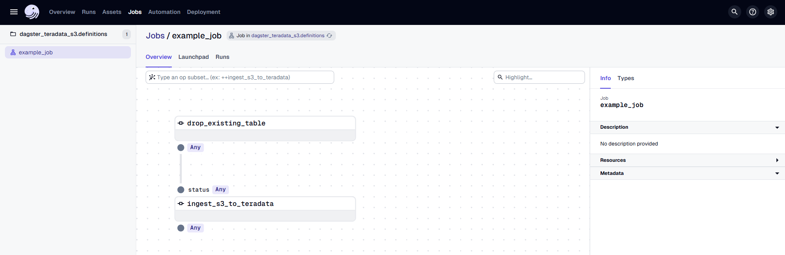
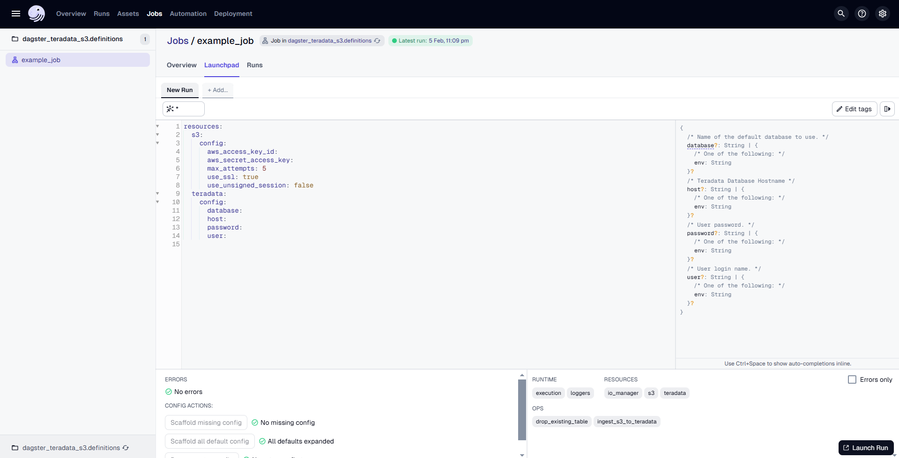
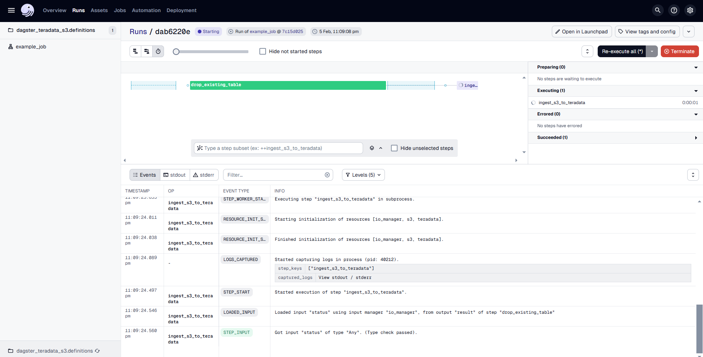

import TrialDocsNote from '../_partials/teradata_trial.mdx'

# Data Transfer from AWS S3 to Teradata Using dagster-teradata

## Overview

This document provides instructions and guidance for transferring data in CSV, JSON and Parquet formats from AWS S3 to Teradata using **dagster-teradata**. It outlines the setup, configuration and execution steps required to establish a seamless data transfer pipeline between these platforms.

## Prerequisites

* Access to a Teradata instance.

    <TrialDocsNote />

* Python **3.9** or higher, Python **3.12** is recommended.
* `uv` [package manager](https://docs.astral.sh/uv/getting-started/installation/) for Python environment management.

## Setting Up the Project with `uv`

We'll use `uv` exclusively to manage dependencies and run commands. No manual venv activation is required.

## Initialize a Dagster Project

We'll use `uvx` to scaffold a new Dagster project, which automatically creates a `pyproject.toml` to manage dependencies.

### Create a New Dagster Project

Run the following command:

```bash
uvx create-dagster@latest project dagster-teradata-s3
```

When prompted, respond `y` to run `uv sync` which will set up the isolated environment and install all dependencies:

This command will create a new project named `dagster-teradata-s3` with the following directory structure:

```bash
dagster-teradata-s3
│   pyproject.toml
│   README.md
│   uv.lock
│   .gitignore
│
├───.venv/                          (virtual environment created by uv sync)
│
├───.dg/                            (Dagster CLI configuration)
│
├───src/
│   └───dagster_teradata_s3/
│       ├── definitions.py
│       ├── defs/
│       │   └── __init__.py
│       └── __init__.py
│
└───tests/
    └── __init__.py
```

Refer to [Dagster documentation](https://docs.dagster.io/guides/build/projects) to learn more about this directory structure.

### Update `pyproject.toml` with Additional Dependencies

Open `pyproject.toml` in the project root and ensure the dependencies section includes the required packages:

```toml
dependencies = [
    ...
    "dagster-teradata",
    "dagster-aws",
]
```

Sync the dependencies:

```bash
cd dagster-teradata-s3
uv sync
```

### Step 1: Open `definitions.py` in `src/dagster_teradata_s3/` Directory  

Locate and open the file at `src/dagster_teradata_s3/definitions.py` where Dagster job definitions are configured.  
This file manages resources, jobs, and assets needed for the Dagster project.

### Step 2: Implement AWS S3 to Teradata Transfer in Dagster

Replace the contents of `src/dagster_teradata_s3/definitions.py` with the following code:

``` python
import os

from dagster import job, op, Definitions, DagsterError
from dagster_aws.s3 import S3Resource
from dagster_teradata import TeradataResource

# Configure S3 resource for public bucket access (no credentials needed)
s3_resource = S3Resource()

# Configure Teradata resource with connection details from environment variables
td_resource = TeradataResource(
    host=os.getenv("TERADATA_HOST"),
    user=os.getenv("TERADATA_USER"),
    password=os.getenv("TERADATA_PASSWORD"),
    database=os.getenv("TERADATA_DATABASE"),
)

@op(required_resource_keys={"teradata"})
def drop_existing_table(context) -> str:
    try:
        context.resources.teradata.drop_table("people")
        context.log.info("Table 'people' dropped successfully")
        return "Tables Dropped"
    except Exception as e:
        context.log.error(f"Failed to drop table: {e}")
        raise

@op(required_resource_keys={"teradata", "s3"})
def ingest_s3_to_teradata(context, status: str) -> str:
    try:
        if status == "Tables Dropped":
            # Validate that AWS_S3_LOCATION is set
            s3_location = os.getenv("AWS_S3_LOCATION")
            if not s3_location:
                raise DagsterError(
                    "AWS_S3_LOCATION environment variable is not set. "
                    "Expected format: /s3/your-bucket.s3.amazonaws.com/path/to/file.csv"
                )
            
            context.log.info(f"Using S3 location: {s3_location}")
            
            # For public S3 buckets, create an S3Resource without credentials
            s3_resource_from_context = context.resources.s3
            context.resources.teradata.s3_to_teradata(
                s3_resource_from_context, 
                s3_location, 
                "people",
                public_bucket=True  # This example uses a public bucket for simplicity
            )
            context.log.info("Data ingested successfully from S3 to Teradata")
            return "Data Ingested"
        else:
            raise DagsterError("Tables not dropped")
    except Exception as e:
        context.log.error(f"Failed to ingest data: {e}")
        raise

@job
def example_job():
    ingest_s3_to_teradata(drop_existing_table())

defs = Definitions(
    jobs=[example_job],
    resources={
        "teradata": td_resource,
        "s3": s3_resource,
    }
)
```

### Explanation of the Code

1. **Resource Configuration for S3 and Teradata**:  

- The code configures resources for interacting with S3 and Teradata.  
- The `S3Resource` can be created with AWS credentials (access key, secret key, and session token) from environment variables. These credentials are optional for public buckets but become required when transitioning to private buckets in production.
- The `TeradataResource` is set up with connection details (host, user, password, database) for Teradata from environment variables.

2. **Defining Operations**:  

- `drop_existing_table`: This operation uses the Teradata resource to drop the "people" table in Teradata. Error handling is included to catch and log any exceptions.
- `ingest_s3_to_teradata`: This operation checks if the "Tables Dropped" status was returned from the previous operation. If true, it ingests data from an S3 bucket to the Teradata table `people` using the S3 resource. The `public_bucket=True` parameter indicates that the S3 bucket is configured as **public**, meaning it can be accessed without authentication. If the table wasn't dropped, it raises an error. Error handling is included for robust operation.
- To use a different table name, replace `"people"` with your table name throughout the code and update your Teradata schema accordingly.

3. **Job Execution**:  

- The `example_job` is defined to execute the two operations sequentially: first, drop the existing table, and then ingest data from S3 to Teradata.  
- The job is registered under the `Definitions` object for execution within the Dagster environment.

## Preparing Your Data

Before running the pipeline, we need to prepare our AWS S3 environment with sample data.

### Create an S3 Bucket

1. Go to [AWS Management Console](https://console.aws.amazon.com/) and navigate to S3.
2. Click **Create bucket** and provide:

- **Bucket name**: Your preferred name
- **Region**: Choose your preferred AWS region (e.g., us-west-2)

3. Click **Create bucket**.

### Upload Sample Data

1. In your S3 bucket, create a folder named `data`.
2. Prepare your data file in CSV, JSON, or Parquet format with columns matching your Teradata table schema.
3. For testing, we recommend a simple CSV file with columns: `id`, `name`, `email`, `city`.

**Sample CSV Content:**

Create a file named `sample_data.csv` with the following content:

```bash
id,name,email,city
1,John Doe,john.doe@example.com,New York
2,Jane Smith,jane.smith@example.com,Los Angeles
3,Bob Johnson,bob.johnson@example.com,Chicago
4,Alice Williams,alice.williams@example.com,Houston
5,Charlie Brown,charlie.brown@example.com,Phoenix
6,Diana Prince,diana.prince@example.com,Philadelphia
7,Eve Davis,eve.davis@example.com,San Antonio
8,Frank Miller,frank.miller@example.com,San Diego
```

4. Upload the file to `s3://your-bucket/data/sample_data.csv`.

### Set Environment Variables

Set the following environment variables for your pipeline:

=== "Windows"

    Run in PowerShell:

    ```bash
    $env:TERADATA_HOST="<your-teradata-host>"
    $env:TERADATA_USER="<your-teradata-user>"
    $env:TERADATA_PASSWORD="<your-teradata-password>"
    $env:TERADATA_DATABASE="<target-database>"
    $env:AWS_S3_LOCATION="/s3/your-bucket.s3.<region>.amazonaws.com/data/sample_data.csv"
    ```

=== "MacOS/Linux"

    ```bash
    export TERADATA_HOST=<your-teradata-host>
    export TERADATA_USER=<your-teradata-user>
    export TERADATA_PASSWORD=<your-teradata-password>
    export TERADATA_DATABASE=<target-database>
    export AWS_S3_LOCATION=/s3/your-bucket.s3.<region>.amazonaws.com/data/sample_data.csv
    ```


**Note on AWS Credentials:** Since this guide uses a **public S3 bucket** (`public_bucket=True`), AWS credentials are **not required**. The pipeline accesses the public bucket directly from Teradata. (AWS credentials become required when using private buckets — see "Public vs Private S3 Buckets" section.)

**Important:** 
- Do NOT repeat the bucket name in the path
- The path component starts directly after `.amazonaws.com/`
- While region is optional for public buckets, including it is a best practice

### Prepare Teradata

Execute the following SQL commands in your Teradata instance to create the target database and table:

```sql
-- Create database (if it doesn't already exist)
CREATE DATABASE dagster_pipeline_db AS PERMANENT = 10000000;

-- Create table
CREATE TABLE dagster_pipeline_db.people (
    id INTEGER,
    name VARCHAR(100),
    email VARCHAR(100),
    city VARCHAR(100)
);
```

> **Note**: If the database already exists, you may see error 5612. If the table already exists, you may see error 3803. Both are safe to ignore if you're just verifying the setup.

## Running the Pipeline

After setting up the project and preparing the data, we can now run our Dagster pipeline:

1. **Start the Dagster Dev Server:**

Run the following command from the project root:

```bash
uv run dg dev
```

The `uv run` command ensures that `dg dev` runs within the project's isolated environment defined in `pyproject.toml`. No manual venv activation is needed.

After executing the command, the Dagster logs will be displayed in the terminal. Once you see a message similar to:

```bash
2025-02-04 09:15:46 +0530 - dagster - INFO - Serving Dagster UI on http://127.0.0.1:3000
```

The Dagster web server is running successfully.

> **Note:** `dg dev` creates an ephemeral instance by default. To persist your runs and assets across sessions, set the `DAGSTER_HOME` environment variable before running `uv run dg dev`:

**Windows (PowerShell):**

```bash
$env:DAGSTER_HOME="$env:USERPROFILE\.dagster_home"
uv run dg dev
```

**macOS/Linux:**

```bash
export DAGSTER_HOME=~/.dagster_home
uv run dg dev
```

2. **Access the Dagster UI:**

Open a web browser and navigate to `http://127.0.0.1:3000`. This will open the Dagster UI where you can manage and monitor your pipelines.



In the Dagster UI, in the jobs tab you will see the following:

- The job **`example_job`** is displayed, along with the associated assets.
- The assets are organized under the **"default"** asset group.
- In the middle, you can view the **lineage** of each `@op`, showing its dependencies and how each operation is related to others.



3. **Launch the Job:**

Go to the **"Launchpad"** tab. Your configuration values (host, user, password, database, AWS credentials) are already populated from the environment variables you set earlier. Simply click **"Launch Run"** to start the pipeline execution.

> **Tip:** If you need to override any values at runtime, you can edit them in the Launchpad before launching. However, for most cases, the environment variables you set in step "Set Environment Variables" will be sufficient.



The Dagster UI allows us to visualize the pipeline's progress, view logs, and inspect the status of each step.


## Public vs Private S3 Buckets

This guide uses a **public S3 bucket** (`public_bucket=True`) for simplicity and ease of testing. In this configuration:

- The S3 bucket is accessible publicly without requiring authentication
- Teradata can access the data directly via S3 URLs
- **AUTHORIZATION object is NOT required**
- Ideal for tutorials, demos, and non-sensitive data

**For production environments with sensitive data**, you should use a **private S3 bucket** (`public_bucket=False`). To implement private bucket access:

### Configure a Private S3 Bucket

**AWS Side:**

- Set your S3 bucket to private (block all public access)
- Create IAM user credentials with S3 read permissions
- Optionally, create a bucket policy to restrict access

**Reference:**

- [AWS S3 Security Best Practices](https://docs.aws.amazon.com/AmazonS3/latest/userguide/security.html)
- [AWS IAM for S3 Access](https://docs.aws.amazon.com/IAM/latest/UserGuide/access_policies_access-advisor.html)

**Dagster/Teradata Side:**

- Change `public_bucket=False` in the code ("Step 2: Implement AWS S3 to Teradata Transfer")
- Provide AWS credentials (access key, secret key) via environment variables
- **Create a Teradata AUTHORIZATION object** (see instructions below)

### Creating a Teradata AUTHORIZATION Object for Private Buckets

An **AUTHORIZATION object** is a Teradata database object that securely stores AWS credentials and controls access to private S3 buckets through Teradata's Native Object Store (NOS).

**Note on Syntax Variations:**
The exact SQL syntax for creating AUTHORIZATION objects varies significantly by Teradata version and configuration. The syntax provided below may not work on all instances.

#### Step 1: Gather AWS Credentials

You will need:

- AWS Access Key ID
- AWS Secret Access Key
- (Optional) AWS Session Token (if using temporary credentials)

#### Step 2: Create AUTHORIZATION Object

The exact SQL syntax depends on your Teradata version. **Consult your Teradata administrator or the official Teradata documentation** for the correct syntax for your specific environment.

For reference, here are common syntax patterns (verify with your Teradata documentation):

```sql
CREATE AUTHORIZATION s3_private_access
AS DEFINER TRUSTED
USER 'your-aws-access-key-id'
PASSWORD 'your-aws-secret-access-key';
```

**IMPORTANT:** Test the CREATE AUTHORIZATION syntax in your environment before using it in production. If you encounter syntax errors, consult:

- Your Teradata administrator
- [Teradata Native Object Store Getting Started Guide](https://docs.teradata.com/search/documents?query=native+object+store)
- [Teradata NOS Documentation](https://docs.teradata.com/r/Enterprise_IntelliFlex_VMware/Teradata-VantageTM-Native-Object-Store-Getting-Started-Guide-17.20/Setting-Up-Access/Controlling-Foreign-Table-Access-with-an-AUTHORIZATION-Object)

#### Step 3: Reference AUTHORIZATION in Dagster Code

Update the `ingest_s3_to_teradata()` operation to use the AUTHORIZATION object:

```python
@op(required_resource_keys={"teradata", "s3"})
def ingest_s3_to_teradata(context, status):
    try:
        if status == "Tables Dropped":
            context.resources.teradata.s3_to_teradata(
                s3_resource_instance, 
                os.getenv("AWS_S3_LOCATION"), 
                "people",
                public_bucket=False,  # Private bucket
                teradata_authorization_name="s3_private_access"  # Reference the AUTHORIZATION object
            )
            context.log.info("Data ingested successfully from S3 to Teradata")
            return "Data Ingested"
        else:
            raise DagsterError("Tables not dropped")
    except Exception as e:
        context.log.error(f"Failed to ingest data: {e}")
        raise
```

#### Important Security Notes:

- **Do NOT hard-code AWS credentials** directly in your Python code
- **Always use environment variables** or Dagster Secrets for sensitive values
- **Rotate credentials regularly** and update the AUTHORIZATION object
- **Use IAM roles** instead of access keys when possible

**Reference:**

- [Teradata Native Object Store - Setting Up Access](https://docs.teradata.com/r/Enterprise_IntelliFlex_VMware/Teradata-VantageTM-Native-Object-Store-Getting-Started-Guide-17.20/Setting-Up-Access/Controlling-Foreign-Table-Access-with-an-AUTHORIZATION-Object)
- [dagster-aws S3Resource Documentation](https://docs.dagster.io/integrations/aws)

## Arguments Supported by `s3_blob_to_teradata`

- **s3 (S3Resource)**:  
  The `S3Resource` object used to interact with the S3 bucket.

- **s3_source_key (str)**:  
  The URI specifying the location of the S3 bucket. The URI format is:  
  `/s3/YOUR-BUCKET.s3.amazonaws.com/YOUR-BUCKET-NAME`  
  For more details, refer to:  
  [Teradata Documentation - Native Object Store](https://docs.teradata.com/search/documents?query=native+object+store&sort=last_update&virtual-field=title_only&content-lang=en-US)

- **teradata_table (str)**:  
  The name of the Teradata table to which the data will be loaded.

- **public_bucket (bool)**:  
  Indicates whether the provided S3 bucket is public. If `True`, the objects within the bucket can be accessed via a URL without authentication. If `False`, the bucket is considered private, and authentication must be provided.  
  Defaults to `False`.

- **teradata_authorization_name (str)**:  
  The name of the Teradata Authorization Database Object, which controls access to the S3 object store.  
  For more details, refer to:  
  [Teradata Native Object Store - Setting Up Access](https://docs.teradata.com/r/Enterprise_IntelliFlex_VMware/Teradata-VantageTM-Native-Object-Store-Getting-Started-Guide-17.20/Setting-Up-Access/Controlling-Foreign-Table-Access-with-an-AUTHORIZATION-Object)

## Summary

This guide details the utilization of the dagster-teradata to seamlessly transfer CSV, JSON, and Parquet data from AWS S3 Storage to Teradata, facilitating streamlined data operations between these platforms.

## Further reading

* [Teradata Authorization](https://docs.teradata.com/r/Enterprise_IntelliFlex_VMware/SQL-Data-Definition-Language-Syntax-and-Examples/Authorization-Statements-for-External-Routines/CREATE-AUTHORIZATION-and-REPLACE-AUTHORIZATION)