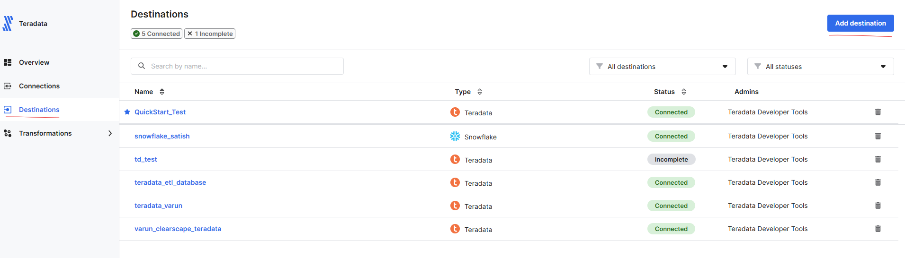
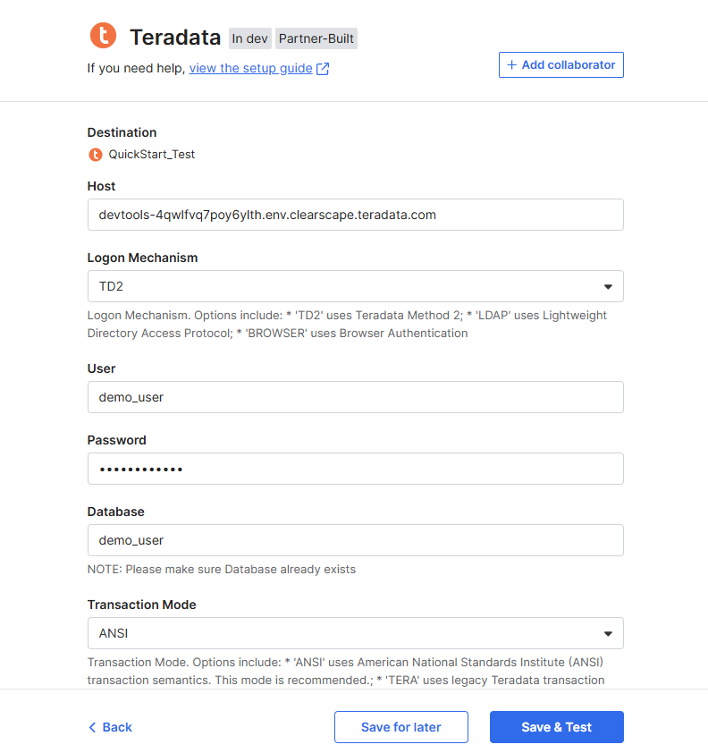
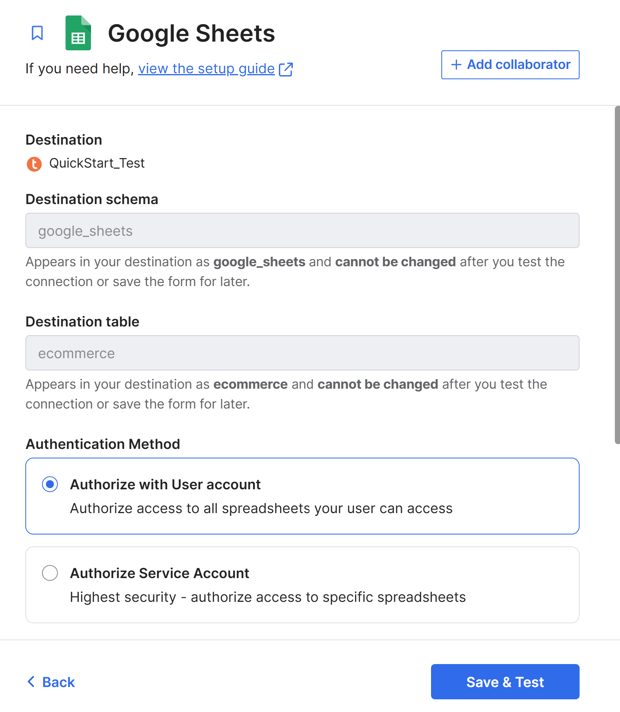
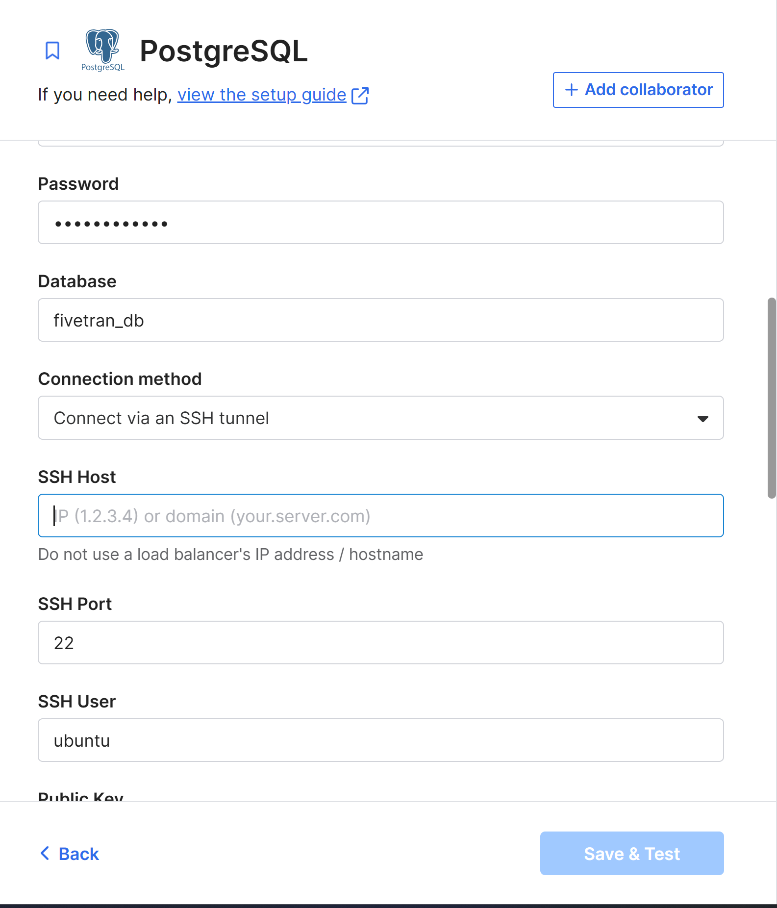
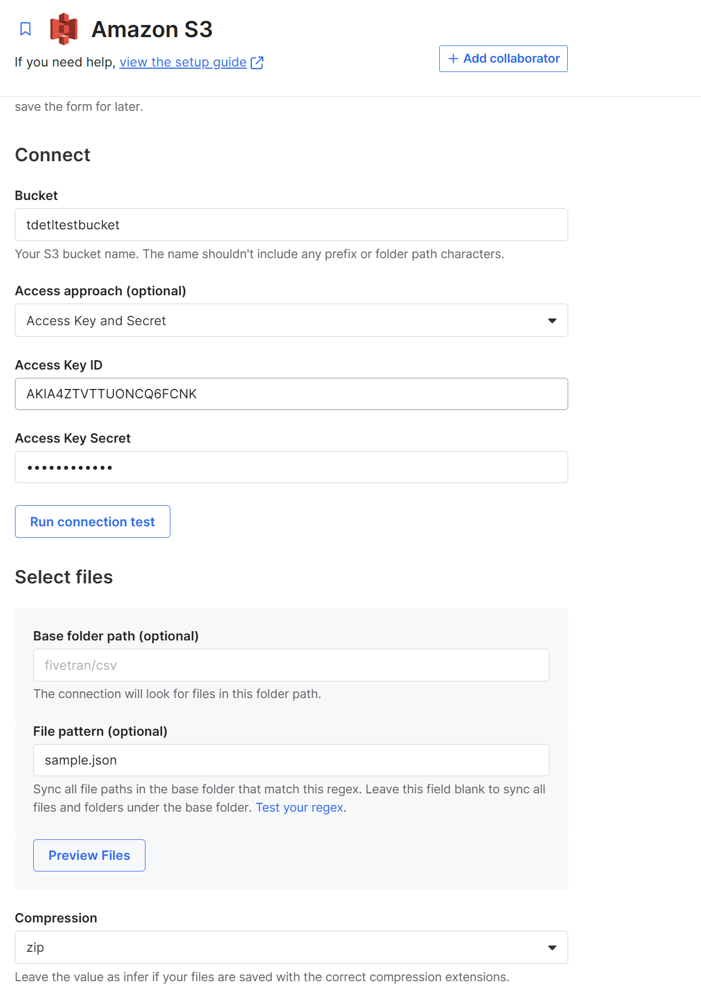

import TrialDocsNote from '../_partials/teradata_trial.mdx'

# Use Fivetran to load data from external sources to Teradata

## Overview
This quickstart demonstrates how to use Fivetran to transfer data from different sources like `Google Sheets`, `PostgreSQL` and `Amazon S3` into `Teradata`.

## Load data from Google Sheets to Teradata

### Before You Begin

Make sure you:

- Have access to a Google account with edit access to the relevant Google Sheet.
- Have an available named range defined in the Google Sheet.
- Have credentials to connect to a Teradata instance.

### Prerequisites
* Active [Fivetran Account](https://fivetran.com/login?_gl=1*9knhuy*_gcl_aw*R0NMLjE3NDM3NDI1MjguQ2p3S0NBanc0N2lfQmhCVEVpd0FhSmZQcHRGNDZmVVFqcnFaMGFiS0VpbVBkSUY3b3lQdTdicDdTZ1R2X3RHZTFGR253OFNYRnI0Nlp4b0MteXdRQXZEX0J3RQ..*_gcl_au*MTg1ODQxODI2LjE3MzgxMzM1Nzg.*_ga*MzM3MDk5MDc3LjE3MzgxMzM1Nzg.*_ga_NE72Z5F3GB*MTc0NDExMjU0MC4xOS4wLjE3NDQxMTI1NDAuNjAuMC4w*_ga_MD1R8Y04Z3*MTc0NDExMjU0MC40LjAuMTc0NDExMjU0MC42MC4wLjA)
* Access to a Teradata instance.
   
   <TrialDocsNote />

!!! note
    When you log in to a newly created Fivetran account, the initial setup flow prompts you to select a source and destination. **Teradata** might not appear as a destination during this onboarding flow.

    Complete or exit the initial setup to access the Fivetran Dashboard. Then, select **Destinations** from the left navigation menu, click **Add destination**, and search for **Teradata**.

### Setup Google Sheets
Refer to the [Google Sheets Setup Guide](https://fivetran.com/docs/connectors/files/google-sheets/google-sheets-setup-guide) to configure sharing permissions and named ranges for data transfer using Fivetran.

### Fivetran Setup: Sync from Google Sheets to Teradata

#### Configure Teradata as Destination
1. Log in to [Fivetran Dashboard](https://fivetran.com/login?_gl=1*9knhuy*_gcl_aw*R0NMLjE3NDM3NDI1MjguQ2p3S0NBanc0N2lfQmhCVEVpd0FhSmZQcHRGNDZmVVFqcnFaMGFiS0VpbVBkSUY3b3lQdTdicDdTZ1R2X3RHZTFGR253OFNYRnI0Nlp4b0MteXdRQXZEX0J3RQ..*_gcl_au*MTg1ODQxODI2LjE3MzgxMzM1Nzg.*_ga*MzM3MDk5MDc3LjE3MzgxMzM1Nzg.*_ga_NE72Z5F3GB*MTc0NDExMjU0MC4xOS4wLjE3NDQxMTI1NDAuNjAuMC4w*_ga_MD1R8Y04Z3*MTc0NDExMjU0MC40LjAuMTc0NDExMjU0MC42MC4wLjA) with valid credentials.
2. Navigate to `Destinations` from the left menu.
3. Click on `Add destination`.
   
4. Search for and select `Teradata`.
5. Provide a name for the destination and click `Add`.
6. Enter the required connection details.
   - `Host`: Provide the Teradata instance hostname
   - `Logon Mechanism`: TD2
   - `Username`: Teradata username
   - `Password`: Teradata password
   - `Database`: Target database name
   - `Transaction Mode`: Select `ANSI` or `TERA`
   
   ##### Optional Connection Parameters

   You can provide additional JDBC or destination-specific parameters to customize the connection. These fields are optional and may not be required for all environments:
   
   ##### `SSL Mode:`  Controls the SSL encryption level. Common values:

     - `DISABLE`: No SSL
     - `ALLOW`: SSL if available
     - `REQUIRE`: Enforce SSL
     - `VERIFY_CA`: Enforce SSL and validate certificate authority
     - `VERIFY_FULL`: Enforce SSL, validate certificate authority, and perform hostname verification

   ##### `JDBC Parameters:` For example:

     - `CHARSET=UTF8`: Sets the character encoding.
     - `ENCRYPTDATA=TRUE`: Enables data encryption in transit.
     - Refer to [Teradata JDBC Driver](https://teradata-docs.s3.amazonaws.com/doc/connectivity/jdbc/reference/current/jdbcug_chapter_2.html) Documentation for a full list of supported options.
     
7. Click `Save and Test`. Ensure the connection test is successful before proceeding.

#### Setup Connection with Source as Google Sheets

1. Go to `Connections` in the Fivetran Dashboard.
2. Click `Add connection`.
3. Search and select `Google Sheets`.
4. Click `Setup`.
5. Choose the `Teradata destination` configured in the previous step.
6. Fill in the Google Sheets source details.
   - `Destination schema`
   - `Destination table`
   - `Authentication Method` - Refer [Google Sheets Setup Guide](https://fivetran.com/docs/connectors/files/google-sheets/google-sheets-setup-guide) to choose appropriate Authentication Method.
   - `Sheet URL`
   - `Select Named Range`
   
7. Click `Save & Test` and confirm the connection success.
8. Click `Continue`. On the `Before you sync` page, choose the appropriate next step, then click `Start initial sync`. Wait until the sync status changes to `Initial sync complete`.

#### Verify Data in Teradata

Once the sync is complete, connect to your `Teradata` instance using a client like `Teradata Studio`:

- Open Teradata Studio and create a new connection.
- Enter the Teradata hostname, username, and password used during Fivetran setup.
- Test the connection and click Finish.
- Navigate to the database 
- Run a `SELECT` query to verify the data from Google Sheets is present.

## Load data from PostgreSQL to Teradata

### Prerequisites
* Access to a PostgreSQL instance.
* Access to a Teradata instance.

   <TrialDocsNote />

### Setup PostgreSQL
Refer to the [Postgres Setup Guide](https://fivetran.com/docs/connectors/databases/postgresql/setup-guide) to configure PostgreSQL on Fivetran.

### Fivetran Setup: Sync from Postgres to Teradata

#### Configure Teradata as Destination
1. Log in to the [Fivetran Dashboard](https://fivetran.com/login?_gl=1*9knhuy*_gcl_aw*R0NMLjE3NDM3NDI1MjguQ2p3S0NBanc0N2lfQmhCVEVpd0FhSmZQcHRGNDZmVVFqcnFaMGFiS0VpbVBkSUY3b3lQdTdicDdTZ1R2X3RHZTFGR253OFNYRnI0Nlp4b0MteXdRQXZEX0J3RQ..*_gcl_au*MTg1ODQxODI2LjE3MzgxMzM1Nzg.*_ga*MzM3MDk5MDc3LjE3MzgxMzM1Nzg.*_ga_NE72Z5F3GB*MTc0NDExMjU0MC4xOS4wLjE3NDQxMTI1NDAuNjAuMC4w*_ga_MD1R8Y04Z3*MTc0NDExMjU0MC40LjAuMTc0NDExMjU0MC42MC4wLjA) with valid credentials.
2. Navigate to `Destinations` in the left menu.
3. Click on `Add destination`.
   
4. Search for and select `Teradata`.
5. Provide a name for the destination and click `Add`.
6. Enter the required connection details.
   - `Host`: Provide the Teradata instance hostname
   - `Logon Mechanism`: TD2
   - `Username`: Teradata username
   - `Password`: Teradata password
   - `Database`: Target database name
   - `Transaction Mode`: Select `ANSI` or `TERA`

   ##### Optional Connection Parameters
   You can provide additional JDBC or destination-specific parameters to customize the connection. These fields are optional and may not be required for all environments:

   ##### `SSL Mode:`  Controls the SSL encryption level. Common values:
   - `DISABLE`: No SSL
   - `ALLOW`: SSL if available
   - `REQUIRE`: Enforce SSL
   - `VERIFY_CA`: Enforce SSL and validate certificate authority
   - `VERIFY_FULL`: Enforce SSL, validate certificate authority, and perform hostname verification
   ##### `JDBC Parameters:` For example:
   - `CHARSET=UTF8`: Sets the character encoding.
   - `ENCRYPTDATA=TRUE`: Enables data encryption in transit.
   - Refer to [Teradata JDBC Driver](https://teradata-docs.s3.amazonaws.com/doc/connectivity/jdbc/reference/current/jdbcug_chapter_2.html) Documentation for a full list of supported options.
     
7. Click `Save and Test`. Ensure the connection test is successful before proceeding.

#### Setup Connection with Source as Postgres
1. Go to `Connections` in the Fivetran Dashboard.
2. Click `Add connection`.
3. Search and select `Postgres`.
4. Click `Setup`.
5. Choose the `Teradata destination` configured in the previous step.
6. Fill in the PostgreSQL source details.
7. Enter the required connection details.
   - `Host`: Provide PostgreSQL instance hostname
   - `Port`: Provide Port Number
   - `User`: PostgreSQL instance username
   - `Password`: PostgreSQL instance password
   - `Database`: Target database name
   - `Connection method`: Choose a connection method based on your PostgreSQL setup. Refer to the [PostgreSQL Setup instructions](https://fivetran.com/docs/connectors/databases/postgresql/setup-guide#setupinstructions) for more information about the available connection methods. This guide uses the `Connect directly` connection method.
   - `Update Method`: Choose your incremental sync method. This guide uses the `Logical Replication` sync method.
     
8. Click `Save & Test` and confirm the connection success.
9. Click on `Continue` to begin the initial data load. Wait until the sync status changes to `Initial sync complete`.

#### Verify Data in Teradata

Once the sync is complete, connect to your `Teradata` instance using a client like `Teradata Studio`:

- Open Teradata Studio and create a new connection.
- Enter the Teradata hostname, username, and password used during Fivetran setup.
- Test the connection and click Finish.
- Navigate to the database
- Run a `SELECT` query to verify the data from PostgreSQL is present.

## Load data from Amazon S3 to Teradata

### Prerequisites
* Access to Amazon S3.
* Access to a Teradata instance.

   <TrialDocsNote />

### Setup Amazon S3
Refer to the [Amazon S3 Setup Guide](https://fivetran.com/docs/connectors/files/amazon-s3/setup-guide-new) to configure Amazon S3 on Fivetran.

### Fivetran Setup: Sync from Amazon S3 to Teradata

#### Configure Teradata as Destination
1. Log in to [Fivetran Dashboard](https://fivetran.com/login?_gl=1*9knhuy*_gcl_aw*R0NMLjE3NDM3NDI1MjguQ2p3S0NBanc0N2lfQmhCVEVpd0FhSmZQcHRGNDZmVVFqcnFaMGFiS0VpbVBkSUY3b3lQdTdicDdTZ1R2X3RHZTFGR253OFNYRnI0Nlp4b0MteXdRQXZEX0J3RQ..*_gcl_au*MTg1ODQxODI2LjE3MzgxMzM1Nzg.*_ga*MzM3MDk5MDc3LjE3MzgxMzM1Nzg.*_ga_NE72Z5F3GB*MTc0NDExMjU0MC4xOS4wLjE3NDQxMTI1NDAuNjAuMC4w*_ga_MD1R8Y04Z3*MTc0NDExMjU0MC40LjAuMTc0NDExMjU0MC42MC4wLjA) with valid credentials.
2. Navigate to `Destinations` from the left menu.
3. Click on `Add destination`.
   
4. Search for and select `Teradata`.
5. Provide a name for the destination and click `Add`.
6. Enter the required connection details.
   - `Host`: Provide the Teradata instance hostname
   - `Logon Mechanism`: TD2
   - `Username`: Teradata username
   - `Password`: Teradata password
   - `Database`: Target database name
   - `Transaction Mode`: Select `ANSI` or `TERA`

   ##### Optional Connection Parameters
   You can provide additional JDBC or destination-specific parameters to customize the connection. These fields are optional and may not be required for all environments:

   ##### `SSL Mode:`  Controls the SSL encryption level. Common values:
   - `DISABLE`: No SSL
   - `ALLOW`: SSL if available
   - `REQUIRE`: Enforce SSL
   - `VERIFY_CA`: Enforce SSL and validate certificate authority
   - `VERIFY_FULL`: Enforce SSL, validate certificate authority, and perform hostname verification

   ##### `JDBC Parameters:` For example:
   - `CHARSET=UTF8`: Sets the character encoding.
   - `ENCRYPTDATA=TRUE`: Enables data encryption in transit.
   - Refer to the [Teradata JDBC Driver](https://teradata-docs.s3.amazonaws.com/doc/connectivity/jdbc/reference/current/jdbcug_chapter_2.html) Documentation for a full list of supported options.
     
7. Click `Save and Test`. Ensure the connection test is successful before proceeding.

#### Setup Connection with Source as Amazon S3
1. Go to `Connections` in the Fivetran Dashboard.
2. Click `Add connection`.
3. Search and select `Amazon S3`.
4. Click `Setup`.
5. Choose the `Teradata destination` configured in the previous step.
6. Fill in the Amazon S3 source details.
7. Enter the required connection details.
   - `Destination schema` 
   - `Destination table` 
   - `Connect`
     - `Bucket`: S3 Bucket Name
     - `Access approach` : Choose Access Key and Secret
     - `Access Key ID`: Access Key ID of your IAM user. 
     - `Access Key Secret`: Secret Access Key of your IAM user.
   - `Compression`: Select ZIP
   - `Format`
     - `File Type`: CSV

   
8. Click `Save & Test` and confirm the connection success.
9. Click on `Continue` to begin the initial data load. Wait until the sync status changes to `Initial sync complete`.

#### Verify Data in Teradata

Once the sync is complete, connect to your `Teradata` instance using a client like `Teradata Studio`:

- Open Teradata Studio and create a new connection.
- Enter the Teradata hostname, username, and password used during Fivetran setup.
- Test the connection and click Finish.
- Navigate to the database
- Run a `SELECT` query to verify the data from Amazon S3 is present.

## Try More Use Cases
Fivetran supports many source and destination combinations. After completing this example, consider:
- Replicating data from Oracle, Salesforce, or another Fivetran-supported source to Teradata.

## Summary

In this guide, you:
- Set up Google Sheets, PostgreSQL, and Amazon S3 as data sources.
- Configured Fivetran to sync data from these sources to Teradata.
- Verified the synchronized data using Teradata Studio.

## Further reading

- [Teradata Documentation](https://docs.teradata.com/r/Enterprise_IntelliFlex_VMware/Database-Introduction/Introduction-Teradata-Vantage)
- [Fivetran Documentation](https://fivetran.com/docs/getting-started/quickstart)
- [Teradata Studio](https://docs.teradata.com/r/Teradata-StudioTM-User-Guide/Getting-Started-With-Studio/Welcome-to-Teradata-Studio)